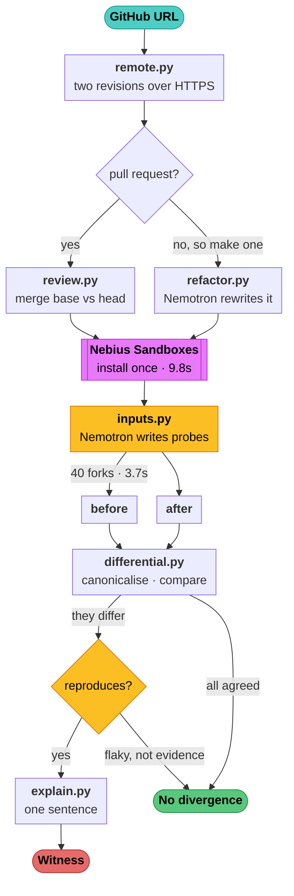

<p align="center">
  
</p>

<h1 align="center">MUTINY</h1>

<p align="center"><b>Did that refactor actually preserve behaviour?</b></p>

<p align="center">
  <a href="https://youtu.be/rEXkEmhaqmc"><b>Demo video, 3 min</b></a> &nbsp;·&nbsp;
  <a href="https://mutiny-verify.vercel.app"><b>Live demo</b></a> &nbsp;·&nbsp;
  <a href="#architecture">Architecture</a> &nbsp;·&nbsp;
  <a href="#results">Results</a> &nbsp;·&nbsp;
  <a href="#setup">Run it yourself</a>
</p>

<p align="center">
  
  
  
</p>

<p align="center">
  <sub>Built for the Nebius x NVIDIA Global AI Hackathon 2026 &nbsp;·&nbsp; Coding and Agentic Engineering track</sub>
</p>

---

### For judges

| Looking for | Go to |
|---|---|
| How NVIDIA Nemotron is used | [How NVIDIA Nemotron is used](#how-nvidia-nemotron-is-used), then the measured comparison of all four variants |
| Where Token Factory accelerated the work | [Where Token Factory accelerated the work](#where-token-factory-accelerated-the-work) |
| Other Nebius tools and services | [Nebius Sandboxes](#nebius-sandboxes), checkpoint forking, 40 isolated microVMs in 3.7s |
| Tavily | [Was the old behaviour promised to anyone?](#was-the-old-behaviour-promised-to-anyone) |
| Does it actually work | [Results](#results), 49 merged pull requests nobody chose for our benefit |
| What it gets **wrong** | [`docs/findings-limits.md`](docs/findings-limits.md), six classes of false finding and one public retraction |
| Running it yourself | [Setup](#setup), macOS, Linux and Windows |
| It running on a real PR | [the comment it left on pull request #1](https://github.com/TusharTechs/mutiny/pull/1) |

---

An agent rewrites your function. The tests pass. MUTINY runs both versions on
hundreds of generated inputs and shows you the exact input where they disagree —
or tells you there isn't one.

```
c = Cache(maxsize=2); c["a"] = 1; sorted(c.items())
    before: [('a', 1)]
    after:  AttributeError: '_DefaultSize' object has no attribute 'get'
```

That is a real refactor, produced by Nemotron 3 Super, of `cachetools.Cache.__setitem__`.
It reads as a tidy-up. It breaks the library for every caller who does not pass
an explicit `getsizeof`.

## Why this exists

Published work finds **19–35% of LLM-generated refactorings are functionally
incorrect, and over 21% of those errors pass the project's existing tests**. We
reproduced the first half independently: of 18 refactors Nemotron produced for
real functions in `semver`, `cachetools` and `packaging`, **17% were rejected by
the repositories' own test suites**.

Teams are now merging agent-written changes at a rate no review process was
designed for, and the test suite is the only gate. When the change is subtle —
an edge case, a default argument, an eviction order — the suite is not enough.

## How it works

The model's only job is to produce **inputs**. Execution produces the evidence.

```
  function under review
          │
          ├── Nemotron generates call expressions and stateful scenarios
          │   (informed by the diff, by tests that already cover the line,
          │    and by the concrete subclasses that can stand in as receivers)
          │
          ├── run every input against the ORIGINAL
          ├── run every input against the REWRITE
          │
          └── compare outcomes ─── divergence? here is the input that proves it
```

That division of labour is the whole design, and it is why this works where our
first attempt did not. **A wrong assertion manufactures a false finding. A wrong
input is rejected identically by both versions and simply contributes nothing.**
Bad inputs are wasted, never wrong — so the model only has to be *productive*,
not *correct*.

An earlier version of this project asked Nemotron to write a test proving a
specific bug. It managed that 13% of the time at 120B and 13% at 550B. Inverting
the burden moved the same task to 62–67%.

## Results

Measured on real code, not fixtures. Every number is reproducible from
`experiments/`.

**Agent refactor safety** — Nemotron refactors a function, the repository's own
tests judge it, and the differential runs regardless:

| | |
|---|---|
| refactors produced | 18 / 21 functions |
| functionally broken (tests rejected them) | **17%** |
| of those, differential also caught | **67%** |
| of the 14 tests accepted, behaviour changed | **0** |
| cost | ~$0.01 per function |

**Detection on real bug-fix commits** — 24 commits across three libraries, each
run twice, ground truth taken from commit messages:

| | |
|---|---|
| behaviour changes detected | **62%** |
| behaviour-preserving commits falsely flagged | **0** |
| runs agreeing across repeats | 94% |

The zero is the number worth defending. Across 14 correct refactors and 5
behaviour-preserving commits, MUTINY has never raised a false alarm.

Getting there meant finding three separate ways a comparison can lie: memory
addresses in the default `repr`, which differ every process; set and dict
iteration order, which made identical collections look different; and hash-seed
randomisation, which changes the behaviour of anything whose logic touches dict
ordering. Each produced confident, specific, entirely false findings before it
was fixed. A verification tool that cries wolf gets switched off in a week.

## How NVIDIA Nemotron is used

Nemotron does two jobs, both load-bearing:

1. **It writes the code under review.** `mutiny/refactor.py` asks
   `nemotron-3-super-120b-a12b` to refactor a real function for readability while
   preserving behaviour. This is the change MUTINY then verifies.
2. **It generates the probes.** `mutiny/inputs.py` asks it for call expressions
   and stateful scenarios that reach the changed lines, steered by the diff, by
   the tests that already cover those lines, and by the concrete subclasses
   available as receivers.

### Choosing a model is about task shape, not parameter count

We measured all four on an identical prompt asking for 45 call expressions:

| model | usable inputs | completion tokens | reasoning emitted | time |
|---|---:|---:|---:|---:|
| Nemotron 3 Nano 30B-A3B | 44 | 9,846 | 26,300 chars | 33.9 s |
| Nemotron 3.5 Lightning | 1 | 14,000 | 0 | 56.0 s |
| **Nemotron 3 Super 120B-A12B** | **42** | **4,520** | **0** | **10.7 s** |
| Nemotron 3 Ultra 550B-A55B | — | — | — | — |

Super emits *no reasoning at all* on this task and answers directly, in a third
of Nano's time for half the tokens. Nano deliberates for 26,000 characters about
how to write call expressions and frequently exhausts its allowance before
writing one.

The reverse held for the harder task. On writing a test that mechanically proves
a specific bug, Ultra scored **identically to Super — 2/15 each**, and Super
failed *worse* than the smaller models when starved of tokens. Bigger was not
better; the shape of the work decided the model.

## Where Token Factory accelerated the work

- **One OpenAI-compatible endpoint for four models.** Swapping Nano for Super
  for Ultra is a string change, which is what made the comparison table above
  cheap enough to actually run rather than assume.
- **`mutiny/models.py`** wraps it with a spend cap, a persistent token ledger and
  content-hash response caching. Re-running an experiment costs nothing, which
  turned a 2.5-hour benchmark into a 20-minute one and made iterating on the
  measurement affordable. Total spend across every experiment in this repository
  is under $3.
- **Reasoning-aware retry.** Nemotron 3 bills its reasoning trace against
  `max_tokens`, so a generous-looking allowance can be spent entirely on
  thinking. The client detects that and widens, except for one signature where
  widening provably never helps (see `docs/feedback.md`).

## Nebius Sandboxes

`mutiny/sandbox.py` implements the executor against the ConTree SDK, behind the
same interface as the local one.

The fit is unusually good: `image.run()` returns a *new* image rather than
mutating the old one, so running N probes against one warm image is **N forks
from a single checkpoint, isolated by construction**. That is exactly this
workload's shape — one expensive setup (clone, install, warm the interpreter),
then hundreds of short independent executions that must not see each other's
state. Locally we pay setup once and then serialise; on Sandboxes the batches run
concurrently, up to the documented ceiling of 50.

Measured against the live service, on `python-semver` installed from source:

| | |
|---|---|
| warm checkpoint (upload, extract, `pip install -e .`) | 9.8 s, paid once |
| 40 forks, run sequentially | 50.4 s |
| **40 forks, run concurrently** | **3.7 s — 0.09 s each** |
| local subprocess, same probes | 0.10 s each |

Forks are genuinely isolated: each inherits everything the checkpoint wrote, sees
nothing a sibling wrote, and leaves the checkpoint unchanged. Sandbox and local
execution agreed on 23 of 23 observations.

The honest comparison is that a *single* sandbox fork is slower than a local
subprocess — 1.2 s against 0.1 s, being network and a microVM. Concurrency is the
entire reason to be here, and it inverts that: at 40 forks the per-fork cost is
below local, and the work is spread across forty isolated machines rather than
competing on one. That matters twice over, because the code being executed was
written by a model and should not run on a developer's laptop at all.

## Try it

```bash
mutiny verify path/to/repo Cache.__setitem__
```

Nemotron rewrites the function, both versions run on generated inputs inside
forks of one warm Sandboxes checkpoint, and you get either the input where they
disagree or a clean bill:

```
cachetools  src/cachetools/__init__.py  Cache.__setitem__  (cachetools)

rewriting with nemotron-3-super-120b-a12b...
    -        diffsize = size - self.__size[key]
    +        old_size = self.__size.get(key, 0)
    +        needed = size - old_size
    ...
warming a sandbox checkpoint...
  ready in 8.8s, 44 KiB uploaded
generating probes...
  10 probes
running both versions...

Behaviour changed.  5 of 10 probes disagree.

  c = LRUCache(3); c["a"] = "x"; c["b"] = "yy"; (sorted(c.items()), c.currsize, len(c))
    before: ([('a', 'x'), ('b', 'yy')], 2, 2)
    after:  AttributeError: '_DefaultSize' object has no attribute 'get'

36.2s, $0.0065
```

`--local` runs the probes on this machine instead, which is faster for a single
pass and appropriate only for code you trust.

### Reviewing a change that already exists

```bash
mutiny verify-diff path/to/repo --base main --head my-branch
```

Finds the functions a branch touched and checks each one, comparing the two
revisions. Nothing is checked out — `git archive` and `git show` read straight
out of the object store, so your working copy is untouched and CI jobs sharing a
clone do not fight each other. One checkpoint is warmed at the merge base, and
each fork has the head version of the changed files laid over the top.

```
python-semver  d8813b67^..d8813b67
2 changed function(s) to check, 1 skipped

Version.next_version  src/semver/version.py
  behaviour changed — 1 of 14 probes disagree
    str(Version(1,2,3, prerelease="rc").next_version("prerelease"))
      before: '1.2.3-rc'
      after:  '1.2.3-rc.0'

2 of 2 changed functions behave differently.
28.4s, $0.0070
```

## Point it at your own code

```bash
mutiny verify-url https://github.com/owner/repo/pull/123
mutiny verify-url https://github.com/owner/repo
```

A pull request is checked against its merge base, so other people's work on main
is not attributed to the change under review. A repository with no change to
review has its most heavily branched function rewritten, and that rewrite
checked.

Only public GitHub repositories, the clone is size-capped, and nothing is
installed or executed on the machine running MUTINY — that happens inside a
sandbox, which is the reason the sandbox is there.

## The web interface

```bash
uv pip install -e ".[web]" --python .venv/bin/python
.venv/bin/python -m uvicorn app.server:app --port 8000
```

Four pre-seeded examples — a rewrite that breaks, one that does not, a real
bug-fix commit reviewed as a pull request, and a pure style commit that should
stay silent. Forks appear as they run, so the concurrency is visible rather than
asserted, and each finding shows the plain-English summary above the input that
proves it.

Repositories are pre-seeded deliberately: a public endpoint that clones and
installs an arbitrary URL on request is an obvious way to be abused, and the
demonstration does not need it.

## Setup

Python 3.11 or newer. No other system dependency: MUTINY talks to GitHub over
HTTPS, so a local `git` is optional, and the code under review is installed and
executed inside a Nebius sandbox rather than on your machine.

**macOS and Linux**

```bash
git clone https://github.com/TusharTechs/mutiny.git
cd mutiny
python3 -m venv .venv
.venv/bin/python -m pip install -e ".[dev]"
cp .env.example .env            # then add NEBIUS_API_KEY and NEBIUS_PROJECT_ID
.venv/bin/python scripts/doctor.py
```

**Windows (PowerShell)**

```powershell
git clone https://github.com/TusharTechs/mutiny.git
cd mutiny
py -3 -m venv .venv
.venv\Scripts\python -m pip install -e ".[dev]"
Copy-Item .env.example .env     # then add NEBIUS_API_KEY and NEBIUS_PROJECT_ID
.venv\Scripts\python scripts\doctor.py
```

If you use [uv](https://docs.astral.sh/uv/), `uv venv --python 3.12 .venv` and
`uv pip install -e ".[dev]"` do the same thing faster. It is not required.

`doctor.py` checks connectivity, credentials, model availability and remaining
spend, and prints what is wrong rather than failing silently. Run it first
whenever anything misbehaves.

Then, on any platform:

```bash
mutiny verify-url https://github.com/python-semver/python-semver/pull/401
```

### Reproducing the results

The benchmarks clone real repositories and run against their history. Paths
below use the POSIX form; on Windows substitute `.venv\Scripts\python`.

```bash
.venv/bin/python -m pytest tests/ -q             # 106 tests, no network needed
.venv/bin/python experiments/refactor/run.py     # agent refactor safety
.venv/bin/python experiments/diff/scaled.py 8    # detection on real fix commits
.venv/bin/python experiments/prs/run.py          # the 49 merged pull requests
```

`experiments/prs/run.py` caches GitHub API responses under
`experiments/prs/cache/`, which is not committed. The first run repopulates it;
set `GITHUB_TOKEN` to lift the 60 requests per hour anonymous limit.

## Architecture

A URL goes in. Two versions of the same code come out the other side, running on
the same generated inputs inside the same sandbox image, and the answer is either
an input where they disagree or a statement that none was found.



### The one idea this is built on

> **Inputs don't need to be correct. Assertions do.**

Ask a model to write a *test* and it must produce an assertion — a claim about
what the right answer is. Get that wrong and you have manufactured a false
finding out of nothing.

Ask a model to write an *input* and it cannot lie. A bad input is rejected
identically by both versions and contributes nothing. A good one is executed
twice, and the two results are compared by a machine that has no opinion about
which is correct.

That inversion is the whole design. **The model generates candidates; execution
produces the evidence.** It is also why this works at all — an earlier version
that asked Nemotron to produce proofs scored 13% at both 120B and 550B, and no
amount of model size fixed it.

### Why there are two revisions, not one

| Input | `before` | `after` |
|---|---|---|
| Pull request URL | the merge base | the head commit |
| Repository URL | the code as written | Nemotron's rewrite of it |
| `mutiny verify-diff` | any ref | any ref |

Comparing against the *merge base* rather than the base branch tip matters: other
people's work on `main` is not this author's change, and attributing it to them
produces findings that waste a reviewer's time.

### Nondeterminism is the adversary, not the bug

The first version of this reported findings that were real divergences and
completely worthless. Five separate causes, each found by chasing a confident,
specific, false result:

| Cause | What it looked like | Fix |
|---|---|---|
| Memory addresses | every object without `__repr__` "changed" | strip `at 0x...` |
| Set and dict order | identical frozensets, different repr | sort before comparing |
| Hash seed | a real-looking cache eviction bug | pin `PYTHONHASHSEED` |
| `random` | `RRCache` evicts differently each run | seed it |
| `os.urandom` | `uuid4` differs by construction | require self-consistency |

The last one is the general answer and the reason `confirm` exists: before a
divergence is reported, the *same version* is run twice on the same input. If it
disagrees with itself, the probe is discarded — it was never evidence. One of
these got as far as being called "the finding this project exists for" before it
turned out to be hash-seed randomisation; that retraction is written up in
[`docs/findings-differential.md`](docs/findings-differential.md).

### What Sandboxes make possible

Installing a real repository takes tens of seconds. Doing that once per probe
would make the whole approach unusable, which is the practical reason
differential verification is not already a common technique.

A Nebius Sandbox checkpoint is installed **once** and then forked. Forty forks
run in **3.7s** against **50.4s** sequentially, and the forks are microVMs rather
than threads — so a probe that segfaults, hangs, or deletes a file takes nothing
with it. Executing a stranger's pull request is the entire point, and it never
touches the server.

| | measured |
|---|---|
| Warm a checkpoint | 9.8s |
| 40 forks, concurrent | 3.7s |
| 40 runs, sequential | 50.4s |
| Django — 2932 files, end to end | 83s |
| Cost of one verification | ~$0.005 |

### Where each model earns its place

Model choice here is decided by the *shape* of the task, not by parameter count.

| Task | Model | Why |
|---|---|---|
| Generating probes | **Nemotron 3 Super 120B** | 42 usable inputs in 10.7s with zero reasoning tokens. Nano spent 26,300 reasoning characters to produce 44; Lightning produced 1. |
| Rewriting a function | **Nemotron 3 Super 120B** | Needs to produce plausible, compiling code — not to be right |
| Explaining a witness | **Nemotron 3 Super 120B** | Grounded in evidence already on the page; the prompt forbids speculating about intent or correctness |
| Fallback on empty reply | **Nemotron 3 Ultra 550B** | Super uniquely returns empty content *and* empty reasoning under token pressure — reported in [`docs/feedback.md`](docs/feedback.md) |

### The modules

| module | responsibility |
|---|---|
| `mutiny/session.py` | the verification loop, yielded as events |
| `mutiny/differential.py` | runs both versions, canonicalises observations, compares |
| `mutiny/sandbox.py` | warm checkpoint, forks, archive upload |
| `mutiny/inputs.py` | Nemotron generates probes; execution-validated before use |
| `mutiny/remote.py` | GitHub over HTTPS — tarballs, merge base, no git binary |
| `mutiny/review.py` | resolving a change into changed functions |
| `mutiny/refactor.py` | Nemotron rewrites a function; applied in place |
| `mutiny/explain.py` | Nemotron describes the change, grounded in the witnesses |
| `mutiny/diff.py` | changed lines, source-vs-test filtering, enclosing functions |
| `mutiny/coverage.py` | which tests execute which line — steers probes and test selection |
| `mutiny/source.py` | locating a function by qualified name, showing just enough of it |
| `mutiny/models.py` | Token Factory client: per-run spend cap, ledger, caching, retry |
| `mutiny/budget.py` | what a public deployment is allowed to spend |
| `mutiny/fetch.py` | git clone, for local experiments that have git |
| `mutiny/tls.py` | reactive certificate trust repair for private certificate authorities |
| `mutiny/cli.py` | terminal rendering of the event stream |
| `app/` | the web interface — the same events over server-sent events |

One engine produces the events; the CLI and the browser are two renderings of it.
There is no second implementation to drift.

An observation records the value's **type**, a canonicalised `repr`, and for
failures the exception type and normalised message. Memory addresses are
stripped, unordered containers are sorted, and the hash seed is pinned — because
an observation that varies for reasons the caller cannot control is not evidence.

## Run it on every pull request

Review happens in the pull request. A tool that lives anywhere else is one
somebody has to remember, and a tool that usually has nothing to say is one they
stop remembering.

```yaml
# .github/workflows/mutiny.yml
name: MUTINY
on: pull_request
permissions:
  contents: read
  pull-requests: write

jobs:
  behaviour:
    runs-on: ubuntu-latest
    steps:
      - uses: TusharTechs/mutiny@main
        with:
          nebius-api-key: ${{ secrets.NEBIUS_API_KEY }}
          nebius-project-id: ${{ secrets.NEBIUS_PROJECT_ID }}
```

It says nothing on most pull requests, and that is the point. Of 49 merged pull
requests measured in [`docs/findings-pull-requests.md`](docs/findings-pull-requests.md),
twelve changed behaviour and ten of those were changes the author had already
announced in the title. Reporting those is noise wearing the costume of
diligence. The comment appears when a behaviour difference is one the change
does not mention:

> ### This change alters behaviour it does not mention
>
> #### `max_ver`
>
> 5 of 11 generated inputs produce a different result before and after this change.
>
> > `max_ver` now raises `TypeError` whenever either argument is already a
> > `Version` instance, because it calls `Version.parse` on it. Previously the
> > function accepted both strings and `Version` objects.
>
> ```python
> max_ver(Version.parse("1.0.0"), Version.parse("1.0.0"))
> # before:  '1.0.0'
> # after:   TypeError: not expecting type '<class 'semver.version.Version'>'
> ```

That one is real and merged. [`python-semver#401`](https://github.com/python-semver/python-semver/pull/401)
is titled *"Simplify max_ver and min_ver"*, and its description says it uses
`max()` and `min()` to make the two functions consistent. The code it replaced
had an explicit `elif not isinstance(ver1, Version)` branch — it accepted
`Version` objects deliberately. The one-line replacement does not.

Two rules, both about trust rather than capability:

- **It never fails a build.** A behaviour difference is information a reviewer
  weighs, not a verdict. A bot that blocks merges on its own judgement is
  switched off within a week.
- **One comment per pull request, edited in place.** Pushing a fix replaces the
  warning rather than leaving it standing above a correction nobody scrolls to.

| input | |
|---|---|
| `comment-on` | `undescribed` (default), `any`, or `never` — `never` still writes the run summary |
| `probes` | inputs generated per function, default 20 |
| `max-functions` | changed functions to check, default 6 |
| `cap-usd` | ceiling on model spend for one run, default 1.00 |

A run costs about half a cent.

### Was the old behaviour promised to anyone?

"Behaviour changed" in an undocumented internal helper is a curiosity. The same
difference in something the project's own documentation specifies is a promise
about to be broken, and that is a different conversation in review.

That question is answered by text outside the repository — published
documentation, changelogs, issue threads — so **Tavily** fetches it, and the
comment escalates only when the documentation describes the behaviour being
removed:

> **The published documentation describes the behaviour this change removes.**
>
> > If `wait` is not supplied, no delay is applied between attempts.
> > — [API reference](https://example.readthedocs.io/api.html)

The obvious failure mode of asking a model about retrieved text is that it
paraphrases something the page does not say, and attaching a link makes that
worse rather than better: it dresses an invention as evidence. So the model must
return a sentence copied verbatim, and **that sentence is checked against the
page it came from**. If it is not there, the finding is dropped entirely — the
same rule as everywhere else here, that a claim which cannot be checked against
something observed is not reported.

Set `TAVILY_API_KEY` to enable it. Without it the step is skipped and the witness
is exactly as strong as it was; a search that fails or finds nothing costs the
report nothing, because this escalates a finding and is never a dependency of
one.

### Keeping what it found

A finding is a moment. Somebody reads it, decides the new behaviour is what they
meant, merges — and nothing stops the next refactor from moving it back. The
comment carries a test that pins what was observed, and `mutiny pin` writes one
directly:

    mutiny pin --url https://github.com/owner/repo/pull/123 --side after

```python
"""Behaviour pinned by MUTINY from https://github.com/owner/repo/pull/123."""
from mutiny.diff import _is_source


def test_is_source_my_setup_py():
    assert repr(_is_source('my_setup.py')) == 'False'
```

This does not break the rule that a model never writes assertions. It doesn't
write these either: the input was generated, *executed* against both versions,
and kept only because the two disagreed — and a human chose which side was
correct before anything was written down. Nothing here is predicted. A value
that cannot be reproduced faithfully, such as a canonicalised set or an object
identity, is refused rather than pinned to something that would fail for the
wrong reason.

## What it does not do

- **Side effects are invisible.** A function that mutates its argument or writes
  a file and returns `None` gives nothing to compare.
- **Exception chaining is not observed.** One known miss is a refactor that
  changed `__context__` while preserving the raised type and message.
- **Pinning the hash seed hides seed-dependent behaviour.** Necessary to compare
  two runs at all, and a real trade-off: it cost us a finding we had to retract.
- **Rich domain objects are hard to probe.** Everything found so far takes
  primitives or simply-constructible values. A function wanting three populated
  domain objects and a timezone-aware datetime defeats the generator, and yield
  collapses to zero.
- **Unreachable code stays unreached.** A branch requiring a particular OS, a
  network condition or a race has no call expression that gets to it.

`docs/findings-differential.md` records the measurements and the retraction in
full, including a finding we reported internally as the headline result and then
withdrew when a pinned hash seed showed it was an artifact of our own harness.

## Licence

Apache-2.0.
